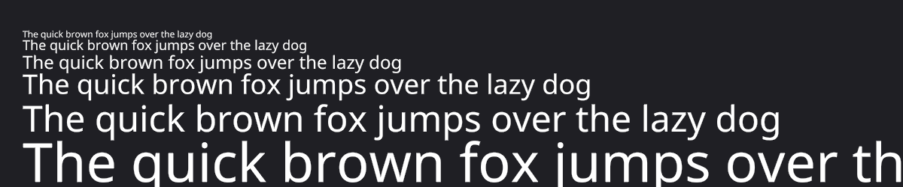

# snail

GPU font rendering via direct Bézier curve evaluation. A Zig implementation of the [Slug algorithm](https://sluglibrary.com/).



Text is rendered by evaluating quadratic Bézier curves per-pixel in a fragment shader. No pre-rasterized glyph bitmaps, no signed distance fields. Glyphs are resolution-independent and render correctly at any size, rotation, or perspective transform. Curve geometry is packed into GPU textures at load time; coverage is computed analytically at runtime.

## Based on

This is an independent implementation of the algorithm described in:

- Eric Lengyel, ["GPU-Centered Font Rendering Directly from Glyph Outlines"](https://jcgt.org/published/0006/02/02/), JCGT 2017
- Eric Lengyel, ["A Decade of Slug"](https://terathon.com/blog/decade-slug.html), 2026
- [Reference HLSL shaders](https://github.com/EricLengyel/Slug) (MIT / Apache-2.0)
- [Sluggish](https://github.com/mightycow/Sluggish) reference C implementation (Unlicense)

The Slug patent (US 10,373,352) was [dedicated to the public domain](https://terathon.com/blog/decade-slug.html) on March 17, 2026 via terminal disclaimer filed with the USPTO. This implementation is original code, not derived from the Slug Library product. Licensed under MIT.

## Build

```sh
zig build test                      # unit tests
zig build bench                     # microbenchmarks (prep, math, vector packing)
zig build bench-compare             # snail vs FreeType
zig build bench-headless            # offscreen OpenGL end-to-end rendering
zig build bench-headless -Dvulkan=true # OpenGL + Vulkan end-to-end rendering
zig build bench-suite               # consolidated GL suite (layout + text + vectors)
zig build demo                      # build the interactive demo (Wayland + EGL)
zig build run                       # run the interactive demo (Wayland + EGL)
zig build run -Dvulkan=true         # Vulkan demo backend (Wayland surface)
zig build run -Dharfbuzz=false      # disable HarfBuzz and use the built-in shaper only
zig build install --release=fast    # install libsnail + header to zig-out/
```

Core library builds require [Zig 0.16](https://ziglang.org/download/), OpenGL, HarfBuzz, and pkg-config. The interactive demo is Linux/Wayland-only and adds Wayland + EGL for the OpenGL path. Headless OpenGL benchmarks use EGL offscreen contexts and do not require a window system. Vulkan loader + headers and shaderc are only needed with `-Dvulkan=true`.

**Nix** — reproducible dev shell and build:

```sh
nix-shell               # dev shell with all deps
nix-build -A lib        # build libsnail + header
nix-build -A demo       # build snail-demo
```

**Arch Linux** — install as a system package:

```sh
cd pkg/arch && makepkg -si
```

Demo controls: arrow keys pan, `Z`/`X` zoom, `R` rotate, `S` stress test, `L` cycle subpixel order (none → RGB → BGR → VRGB → VBGR).

## Usage

```zig
const snail = @import("snail");

// Parse font (one-time)
var font = try snail.Font.init(ttf_bytes);
defer font.deinit();

const cell_gid = try font.glyphIndex('M');
const cell_advance = try font.advanceWidth(cell_gid);
const cell_bbox = try font.bbox(cell_gid);
_ = .{ cell_advance, cell_bbox };

// Build an immutable atlas snapshot for the glyphs you want
var atlas = try snail.Atlas.initAscii(allocator, &font, &snail.ASCII_PRINTABLE);
defer atlas.deinit();

// Create renderer and upload atlas pages (requires GL 3.3+ context)
var renderer = try snail.Renderer.init();
defer renderer.deinit();
var atlas_view = renderer.uploadAtlas(&atlas);

// Build a vertex batch (per-frame for dynamic text, or once for static)
var buf: [5000 * snail.FLOATS_PER_GLYPH]f32 = undefined;
var batch = snail.Batch.init(&buf);
_ = batch.addString(atlas_view, &font, "Hello, world!", x, y, 48.0, .{ 1, 1, 1, 1 });

// Draw (call beginFrame() once per frame when sharing a GL context with other renderers)
renderer.beginFrame();
renderer.draw(batch.slice(), mvp, viewport_w, viewport_h);
```

Atlas uploads now return lightweight `AtlasView` values. Existing glyph handles remain stable across `extendGlyphIds()`, `extendCodepoints()`, and `extendGlyphsForText()` because those operations return a new atlas snapshot that shares old pages. `compact()` returns a new snapshot too, but may repack handles.

### Vector primitives and pictures

snail's vector side is explicit and style-oriented: you describe fill/stroke state, optional per-primitive affine transforms, and pack rectangles / rounded rectangles / ellipses into a caller-owned buffer. Static vector UI can then be frozen into an immutable `VectorPicture`. Those primitives still draw from one packed record each, but coverage is evaluated from procedural quadratic curves with the same Slug root-solving math used for text.

```zig
var shape_buf: [256 * snail.VECTOR_FLOATS_PER_PRIMITIVE]f32 = undefined;
var shapes = snail.VectorBatch.init(&shape_buf);

const card_fill = snail.VectorFillStyle{ .color = .{ 0.12, 0.16, 0.22, 0.92 } };
const card_stroke = snail.VectorStrokeStyle{ .color = .{ 0.35, 0.55, 0.95, 1.0 }, .width = 2.0 };

_ = shapes.addRoundedRectStyled(
    .{ .x = 24, .y = 24, .w = 240, .h = 96 },
    card_fill,
    card_stroke,
    18.0,
    .identity,
);
_ = shapes.addEllipseStyled(
    .{ .x = 300, .y = 32, .w = 72, .h = 72 },
    .{ .color = .{ 0.95, 0.72, 0.28, 0.2 } },
    .{ .color = .{ 0.95, 0.72, 0.28, 0.9 }, .width = 1.5 },
    snail.VectorTransform2D.translate(0, 0),
);

var picture = try shapes.freeze(allocator);
defer picture.deinit();

renderer.beginFrame();
renderer.drawVectorPicture(&picture, viewport_w, viewport_h); // top-left pixel-space convenience
renderer.draw(text_batch.slice(), mvp, viewport_w, viewport_h);
```

For scene-style transforms, use `Renderer.drawVectorTransformed()` / `drawVectorPictureTransformed()` with your own `Mat4`. The renderer expands vector quads automatically so edge antialiasing is not clipped at primitive bounds.

### CPU renderer

For headless output or bootstrap frames, `src/extra/cpu_renderer.zig` exposes a software raster path that shares Snail's atlas data and vector packing model:

```zig
const cpu_renderer = @import("extra/cpu_renderer.zig");

var soft = cpu_renderer.CpuRenderer.init(pixel_buf.ptr, width, height, stride);
soft.clear(0, 0, 0, 0);
soft.drawGlyphId(&atlas, try font.glyphIndex('A'), 12, 28, 24, .{ 1, 1, 1, 1 });
soft.drawVector(shapes.slice());
soft.drawVectorPicture(&picture);
```

The CPU vector path consumes the same packed `VectorBatch` / `VectorPicture` data as the GPU path, including per-primitive `VectorTransform2D` transforms, fill rule, and subpixel order. It uses the same procedural quadratic coverage model as the GPU vector path. It still mirrors the pixel-space `drawVector()` convenience path, not the global-`Mat4` `drawVectorTransformed()` API.

### Performance model

| Operation | Frequency | Cost |
|-----------|-----------|------|
| `Font.init` | Once per font | ~2.0 us |
| `Atlas.init` | Once per glyph set | ~1.7 ms for 95 ASCII glyphs |
| `Atlas.extendCodepoints` | On late glyph discovery | Allocates a new snapshot, preserving old handles |
| `Renderer.uploadAtlas` | Once per atlas generation | GPU texture upload for atlas pages |
| `Batch.addString` | Per-frame (dynamic) or once (static) | ~1.2 us for 13 chars, ~15.1 us for 175 chars |
| `VectorBatch.addRoundedRectStyled` | Per-frame (dynamic) or once (static) | ~1.5 ns per primitive |
| `VectorBatch.freeze` | Static UI / icons | Clone once into an immutable `VectorPicture` |
| `Renderer.beginFrame` | Per-frame | Resets cached GL state (call before `draw` when sharing a GL context) |
| `Renderer.draw` | Per-frame | Single draw call per batch |
| `Renderer.drawVector` / `drawVectorPicture` | Per-frame | Single draw call per vector batch or picture |

For static UI text, build the `Batch` once and call `Renderer.draw` each frame with the same `batch.slice()`. The vertex buffer is caller-owned and zero-allocation.

For dynamic text (input fields, counters, chat), rebuild the `Batch` each frame. On this machine, Latin layout is roughly `0.08-0.09 us/glyph`, so 1000 glyphs stays comfortably sub-millisecond.

### Dynamic glyph loading

Add glyphs at runtime by creating a new snapshot, then swap the atlas pointer and re-upload the returned pages:

```zig
if (try atlas.extendText("مرحبا بالعالم")) |next| {
    snail.replaceAtlas(&atlas, next);
    atlas_view = renderer.uploadAtlas(&atlas);
}
```

`Atlas.extendText()` is the high-level entry point for UTF-8 strings. It uses HarfBuzz shaping when available, otherwise it falls back to codepoint discovery plus built-in ligature loading.

Lower-level entry points are still available when you already have codepoints or shaped glyph runs:

```zig
const new_codepoints = [_]u32{ 0x00E9, 0x00F1, 0x00FC }; // é, ñ, ü
if (try atlas.extendCodepoints(&new_codepoints)) |next| {
    snail.replaceAtlas(&atlas, next);
    atlas_view = renderer.uploadAtlas(&atlas);
}

const glyph_ids = [_]u16{ try font.glyphIndex('M'), try font.glyphIndex('W') };
if (try atlas.extendGlyphIds(&glyph_ids)) |next| {
    snail.replaceAtlas(&atlas, next);
    atlas_view = renderer.uploadAtlas(&atlas);
}
```

### Word wrapping

```zig
_ = batch.addStringWrapped(atlas_view, &font, paragraph, x, y, 14.0, max_width, 20.0, color);
```

All public color inputs are straight RGBA. snail premultiplies internally before blending on both GPU and CPU paths.

### Fill rule

Supports both non-zero winding (TrueType default) and even-odd fill rules:

```zig
renderer.setFillRule(.even_odd);
```

### Subpixel rendering

`renderer.setSubpixelOrder(.rgb)` enables LCD subpixel antialiasing. The fragment shader evaluates coverage at three sub-pixel offsets, tripling effective resolution in the subpixel axis. This applies to both glyphs and procedural vector primitives. Most visible on standard-DPI displays at small font sizes.

All five orders are supported: `.none` (off), `.rgb`, `.bgr`, `.vrgb`, `.vbgr`. The demo auto-detects the system base order via fontconfig, and the `L` key cycles orders at runtime.

```zig
renderer.setSubpixelOrder(.rgb);   // horizontal RGB (most common)
renderer.setSubpixelOrder(.vrgb);  // vertical RGB (rotated display)
renderer.setSubpixelOrder(.none);  // disable (OLED/HiDPI)
```

### OpenType shaping

Built-in ligature substitution (GSUB type 4) and kerning (GPOS type 2) with kern table fallback. Sufficient for Latin, Cyrillic, and Greek text.

For complex scripts (Arabic, Devanagari, Thai, etc.), compile with `-Dharfbuzz=true`:

```zig
// HarfBuzz is used automatically by addString() when enabled
if (try atlas.extendText("مرحبا بالعالم")) |next| {
    snail.replaceAtlas(&atlas, next);
    atlas_view = renderer.uploadAtlas(&atlas);
}
_ = batch.addString(atlas_view, &font, "مرحبا بالعالم", x, y, 32, color);
```

When HarfBuzz is not compiled in, `addString` uses the built-in shaper. The `addShaped()` API is always available for callers who use an external shaper.

### C API

`#include "snail.h"` — see [`include/snail.h`](include/snail.h) for the full interface.

```c
#include "snail.h"

SnailFont *font;
snail_font_init(ttf_data, ttf_len, &font);

uint32_t codepoints[] = { 'A', 'B', 'C', /* ... */ };
SnailAtlas *atlas;
snail_atlas_init(NULL, font, codepoints, num_codepoints, &atlas);  // NULL = libc malloc

// GL thread
snail_renderer_init();
snail_renderer_upload_atlas(atlas);

float vertices[5000 * snail_floats_per_glyph()];
size_t len = 0;
float color[] = {1, 1, 1, 1};
snail_batch_add_string(vertices, sizeof(vertices)/sizeof(float), &len,
                       atlas, font, "Hello", 5, x, y, 48.0f, color);

snail_renderer_draw(vertices, len, mvp, viewport_w, viewport_h);

float vector_buf[64 * snail_vector_floats_per_primitive()];
size_t vector_len = 0;
SnailVectorRect panel = {24, 24, 240, 96};
SnailVectorFillStyle fill = {{0.12f, 0.16f, 0.22f, 0.92f}};
SnailVectorStrokeStyle stroke = {{0.35f, 0.55f, 0.95f, 1.0f}, 2.0f};
snail_vector_batch_add_rounded_rect_ex(vector_buf, sizeof(vector_buf)/sizeof(float), &vector_len,
                                       panel, &fill, &stroke, 18.0f, NULL);
snail_renderer_draw_vector_pixels(vector_buf, vector_len, viewport_w, viewport_h);
```

Pass a `SnailAllocator` to `snail_atlas_init` for custom allocation, or `NULL` for libc malloc/free. The C API is OpenGL-only; Vulkan requires the Zig API.

### Using as a Zig dependency

Add snail to your `build.zig.zon`:

```zig
.dependencies = .{
    .snail = .{ .path = "../snail" },  // or .url for remote
},
```

In your `build.zig`, the simplest path is to use snail's helper module. This links OpenGL and enables HarfBuzz by default, but does not pull in the demo's Wayland/EGL deps:

```zig
const snail_dep = b.dependency("snail", .{});
const snail_mod = @import("snail").module(snail_dep.builder, target, optimize);
root_module.addImport("snail", snail_mod);
```

If you need non-default build options, construct the module manually:

```zig
const snail_dep = b.dependency("snail", .{});

const snail_opts = b.addOptions();
snail_opts.addOption(bool, "enable_profiling", false);
snail_opts.addOption(bool, "enable_harfbuzz", false);
snail_opts.addOption(bool, "enable_vulkan", false);
snail_opts.addOption(bool, "force_gl33", true);

const vk_stub = b.createModule(.{
    .root_source_file = b.addWriteFiles().add("vk_stub.zig", ""),
});
const snail_mod = b.createModule(.{
    .root_source_file = snail_dep.path("src/snail.zig"),
    .target = target,
    .optimize = optimize,
    .link_libc = true,
});
snail_mod.addOptions("build_options", snail_opts);
snail_mod.linkSystemLibrary("OpenGL", .{});
snail_mod.addImport("vulkan_shaders", vk_stub);
root_module.addImport("snail", snail_mod);
```

The caller must have an active OpenGL 3.3+ context before calling `Renderer.init()`. snail manages its own GL state (shader programs, VAOs, textures, blend/depth) per draw call. If other renderers share the GL context, call `renderer.beginFrame()` once per frame before `draw()` / `drawVector()` so snail re-binds its cached state.

### Thread safety

| Type | Thread model |
|------|-------------|
| `Font` | Immutable after init. Safe for concurrent reads from any thread. |
| `Atlas` | Immutable snapshot. `extend*()` returns a new snapshot that preserves existing handles; `compact()` returns a new snapshot and may repack them. Safe for concurrent reads. |
| `Batch` | Operates on caller-owned buffers. Multiple batches reading the same `AtlasView` from different threads is safe. |
| `VectorPicture` | Immutable after creation. Safe for concurrent reads from any thread. |
| `Renderer` | **Single-thread per context.** GL: all calls must be on the thread with the active GL context. Vulkan: all calls must be externally synchronized. |

Typical game pattern:
1. **Load thread**: `Font.init` + `Atlas.init` (CPU-only, no GPU context needed)
2. **Render thread**: `Renderer.uploadAtlas` (once), `Renderer.draw` (per frame)
3. **Any thread(s)**: `Batch.addString` into thread-local buffers, submit to render thread for drawing

Static text (HUD, menus): build the `Batch` once, reuse the vertex slice every frame. The draw call is a VBO upload + single `glDrawElements`.

## Architecture

```
src/
  snail.zig              public API: Font, Atlas, Renderer, Batch
  c_api.zig              C bindings (extern functions)
  font/ttf.zig           TrueType parser (head, maxp, cmap, glyf, loca, hhea, hmtx, kern)
  font/opentype.zig      OpenType shaper (GSUB ligatures, GPOS kerning)
  font/harfbuzz.zig      HarfBuzz integration (optional, -Dharfbuzz=true)
  font/snail_file.zig    .snail preprocessed format (zero-parse loading)
  math/                  Vec2, Mat4, QuadBezier, quadratic root solver
  render/
    gl.zig               OpenGL cImport (shared by pipeline and library consumers)
    platform.zig         demo OpenGL platform (Wayland + EGL)
    wayland_window.zig   demo Wayland window/input glue
    egl_offscreen.zig    offscreen EGL context helper for benchmarks
    shaders.zig          GLSL 330 vertex + fragment shaders (Slug algorithm)
    pipeline.zig         OpenGL state management (GL 3.3/4.4)
    vulkan_pipeline.zig  Vulkan state management (optional, -Dvulkan=true)
    vulkan_shaders.zig   SPIR-V shaders (compiled from GLSL at build time)
    curve_texture.zig    RGBA16F curve control point texture
    band_texture.zig     RG16UI spatial band subdivision texture
    vertex.zig           glyph quad vertex generation (5x vec4 per vertex)
    vector_vertex.zig    vector primitive vertex packing
    vector_pipeline.zig  OpenGL vector primitive pipeline (procedural Slug coverage)
  profile/timer.zig      comptime-gated CPU timers (zero overhead when disabled)
include/
  snail.h                C header
```

### How it works

1. **TTF parsing**: extract glyph outlines as quadratic Bézier curves from TrueType font files.

2. **Curve texture**: pack all control points into an RGBA16F texture. Each curve occupies two texels: `(p1.x, p1.y, p2.x, p2.y)` and `(p3.x, p3.y, -, -)`.

3. **Band texture**: subdivide each glyph's bounding box into horizontal and vertical bands. Each band stores which curves intersect it. This reduces per-pixel work from O(all curves) to O(curves in band).

4. **Vertex shader**: apply dynamic dilation (expand glyph quads by ~0.5px along normals using the inverse Jacobian of the MVP transform) to prevent dropped pixels at edges. Vector primitives keep the same one-quad envelope idea so edge coverage is not clipped.

5. **Fragment shader**: for each pixel, determine its band, fetch the relevant curves, cast horizontal and vertical rays, solve the resulting quadratic equations, classify roots via control point sign patterns (the core Slug technique), accumulate a winding number, and convert to fractional coverage for antialiasing. Vector primitives follow the same coverage model, but generate their quadratic curves procedurally from the packed rect / rounded-rect / ellipse parameters instead of looking them up from the glyph atlas.

Curves within each band are sorted by descending maximum coordinate, enabling early exit when no further curves can affect the pixel.

## Benchmarks

`zig build bench` runs internal microbenchmarks. `zig build bench-compare` compares prep/layout against FreeType. `zig build bench-headless` measures fully offscreen frame time, and `zig build bench-suite` prints the consolidated OpenGL suite including vector primitives.

### snail vs FreeType (`zig build bench-compare`)

NotoSans-Regular.ttf, 95 ASCII glyphs, ReleaseFast, 500 layout iterations:

| Metric | snail | FreeType |
|--------|-------|----------|
| Font load | 2.5 us | 41.4 us |
| Glyph prep (1 size) | 1,677.2 us | 1,395.3 us |
| Glyph prep (7 sizes) | **1,677.2 us** | 8,859.6 us |
| Layout: 13-char string | **1.2 us** | 103.3 us |
| Layout: 53-char sentence | **3.8 us** | 522.1 us |
| Layout: 175-char paragraph | **15.1 us** | 1,882.8 us |
| Layout: paragraph × 7 sizes | **90.1 us** | 13,540.2 us |
| Texture memory | 64 KB (all sizes) | 63 KB (1 size) / 525 KB (7 sizes) |
| Re-rasterize for new size | **0** (resolution-independent) | ~1,244 us per extra size |

snail still pays more upfront than FreeType for one raster size, but that prep cost stays flat across sizes and layout remains roughly `84-150x` faster on this machine.

### End-to-end rendering (`zig build bench-headless`)

**Methodology**: fully headless — no display, no window system involvement in the measured path.

- **OpenGL**: offscreen EGL pbuffer + 1280×720 FBO. Each frame renders into the FBO, then calls `glFinish` to wait for GPU completion before timing the next frame.
- **Vulkan**: no window, no surface, no swapchain. Renders into a `VkImage` (`VK_FORMAT_R8G8B8A8_UNORM`) allocated in device memory. `vkQueueWaitIdle` after each submit ensures full CPU+GPU frame time is measured with no pipelining. This is a conservative lower bound — real applications pipeline CPU and GPU work across frames.

Both backends render 2000 frames per scenario at 1280×720, ReleaseFast. Frame time = wall time / 2000.

**Static**: vertex buffer built once, reused every frame — simulates a game HUD or static menu.  
**Dynamic**: vertex buffer rebuilt from glyph metrics every frame — simulates chat, debug overlay, or any text that changes each frame.

#### OpenGL 4.4 (persistent mapped)

| Scenario | Glyphs | Static FPS | Static frame | Dynamic FPS | Dynamic frame |
|----------|--------|-----------|-------------|------------|--------------|
| Game HUD (2 lines) | 45 | 26,079 | 38.3 us | 28,149 | 35.5 us |
| Multi-size (6 sizes) | 270 | 17,674 | 56.6 us | 16,556 | 60.4 us |
| Body text (6 paragraphs) | 978 | 9,858 | 101.4 us | 7,147 | 139.9 us |
| Torture (fill screen) | 4,075 | 3,167 | 315.7 us | 2,100 | 476.1 us |
| Arabic (12 lines) | 264 | 28,173 | 35.5 us | 14,136 | 70.7 us |
| Devanagari (12 lines) | 120 | 37,301 | 26.8 us | 12,870 | 77.7 us |
| Game UI (3 fonts) | 57 | 29,155 | 34.3 us | 26,466 | 37.8 us |
| Chat (6 msgs, 4 fonts) | 106 | 24,818 | 40.3 us | 26,943 | 37.1 us |
| Multi-font torture (24 lines) | 522 | 14,941 | 66.9 us | 8,166 | 122.5 us |

#### Vulkan (offscreen, per-frame sync)

| Scenario | Glyphs | Static FPS | Static frame | Dynamic FPS | Dynamic frame |
|----------|--------|-----------|-------------|------------|--------------|
| Game HUD (2 lines) | 45 | 16,338 | 61.2 us | 15,911 | 62.9 us |
| Multi-size (6 sizes) | 270 | 14,999 | 66.7 us | 10,919 | 91.6 us |
| Body text (6 paragraphs) | 978 | 12,857 | 77.8 us | 5,177 | 193.2 us |
| Torture (fill screen) | 4,075 | 6,669 | 149.9 us | 1,689 | 592.1 us |
| Arabic (12 lines) | 264 | 16,559 | 60.4 us | 8,134 | 122.9 us |
| Devanagari (12 lines) | 120 | 15,688 | 63.7 us | 7,131 | 140.2 us |
| Game UI (3 fonts) | 57 | 15,487 | 64.6 us | 13,454 | 74.3 us |
| Chat (6 msgs, 4 fonts) | 106 | 16,697 | 59.9 us | 10,471 | 95.5 us |
| Multi-font torture (24 lines) | 522 | 15,465 | 64.7 us | 4,975 | 201.0 us |

`zig build bench-suite` currently reports about `77 us` for a 10-shape OpenGL vector showcase and `224 us` for a 587-shape stress scene.

### Other GPU font renderers

| Project | Language | GPU API | Notes |
|---------|----------|---------|-------|
| [Slug Library](https://sluglibrary.com/) | C++ | Vulkan/D3D/GL/Metal | Commercial. The reference implementation (10 years of optimization). |
| [slug_wgpu](https://github.com/santiagosantos08/slug_wgpu) | Rust | wgpu | FOSS Slug implementation. |
| [gpu-font-rendering](https://github.com/GreenLightning/gpu-font-rendering) | C++ | OpenGL | Dobbie/Lengyel technique. |
| [Pathfinder](https://github.com/pcwalton/pathfinder) | Rust | GL/Metal | General vector graphics GPU rasterizer. |
| **snail** | **Zig** | **OpenGL 3.3+ / Vulkan** | **This project. C API. MIT licensed.** |

## License

MIT. See [LICENSE](LICENSE).
