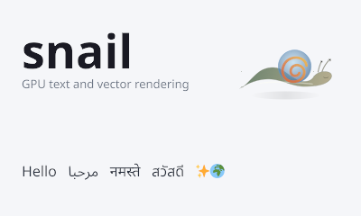

# snail

GPU text and vector rendering via direct Bezier curve evaluation.



snail renders text by evaluating quadratic Bezier curves per-pixel in a fragment shader. No bitmap atlases, no signed distance fields. Glyphs are resolution-independent and render correctly at any size, rotation, or perspective transform. The same curve evaluation pipeline also renders filled and stroked vector paths with solid, gradient, and image paints.

This is alpha-quality software. The Zig API is settling but not yet stable. The C API is legacy and disabled by default while the Zig resource model is being migrated. Breaking changes are expected.

## Algorithm

This is an implementation of the [Slug algorithm](https://sluglibrary.com/):

- Eric Lengyel, ["GPU-Centered Font Rendering Directly from Glyph Outlines"](https://jcgt.org/published/0006/02/02/), JCGT 2017
- Eric Lengyel, ["A Decade of Slug"](https://terathon.com/blog/decade-slug.html), 2026
- [Reference HLSL shaders](https://github.com/EricLengyel/Slug) (MIT / Apache-2.0)

The Slug patent (US 10,373,352) was [dedicated to the public domain](https://terathon.com/blog/decade-slug.html) in March 2026. This implementation is original code, not derived from the Slug Library product. Licensed under MIT.

### How it works

**Font loading.** snail parses TrueType fonts directly: `cmap` for codepoint-to-glyph mapping, `glyf`/`loca` for outlines, `hhea`/`hmtx` for metrics, `kern` for legacy kerning. Optional OpenType shaping applies GSUB ligature substitution (type 4) and GPOS pair positioning (type 2). HarfBuzz can be compiled in for full complex-script shaping.

**Atlas preparation.** Each glyph's quadratic Bezier curves are packed into two GPU textures at load time:

- *Curve texture* (RGBA16F): control points for every curve segment, stored as f16 in font-unit coordinates.
- *Band texture* (RG16UI): spatial subdivision indices. The glyph bounding box is split into horizontal and vertical bands; each band records which curve segments intersect it.

This preprocessing is CPU-only and runs once per glyph set. The textures are uploaded as 2D texture arrays, one layer per atlas page.

**Fragment shader.** At draw time, each glyph is a screen-space quad. The fragment shader:

1. Reads the band indices for this fragment's position.
2. For each curve in the active bands, evaluates a quadratic Bezier root equation to count ray crossings.
3. Applies the winding rule (non-zero or even-odd) to determine inside/outside.
4. Outputs analytic coverage as alpha, optionally with per-channel LCD subpixel offsets for horizontal RGB/BGR or vertical VRGB/VBGR subpixel rendering.

There is no rasterization, no texture sampling for glyph shapes, and no distance field approximation. Coverage is exact at every resolution.

**Vector paths.** Filled and stroked `Path` geometry goes through the same pipeline. Paths are decomposed into quadratic curves (cubics are adaptively approximated), packed into the same curve/band texture format, and drawn with the same fragment shader. Strokes are expanded into offset curves with proper joins (miter, bevel, round) and caps (butt, square, round). The `PathPicture` type freezes a set of styled paths into an immutable atlas snapshot that can be instanced cheaply per frame.

## Color convention

All color parameters are **sRGB, straight (unpremultiplied) alpha**, as `[4]f32` in the range 0.0–1.0. This applies to `FillStyle.color`, `StrokeStyle.color`, gradient stops, `ImagePaint.tint`, and text color arguments. The renderer premultiplies alpha and linearizes for blending internally.

**Images** (`Image.initSrgba8`) expect sRGB-encoded RGBA8 pixel data (4 bytes per pixel, 0–255). This is what most image decoders produce. Linear-space pixel buffers will appear too bright.

**Gradients** interpolate in sRGB space by default, which gives perceptually smooth results for UI use. Set `color_space = .linear_rgb` on `LinearGradient` or `RadialGradient` for physically correct interpolation (avoids dark bands between complementary hues).

**Blending** uses premultiplied alpha with gamma-correct (linear-space) compositing. On GPU, `GL_FRAMEBUFFER_SRGB` / Vulkan sRGB swapchain handles linearization automatically. The CPU renderer uses equivalent lookup tables.

## Build

Requires [Zig 0.16](https://ziglang.org/download/), OpenGL 3.3+, HarfBuzz, and pkg-config. The interactive demo requires Wayland + EGL. Vulkan support is optional.

```sh
zig build test                                  # unit tests
zig build run                                   # interactive demo (GL 4.4, Wayland)
zig build run -Drenderer=gl33                   # force OpenGL 3.3
zig build run -Drenderer=vulkan -Dvulkan=true   # Vulkan backend
zig build run -Drenderer=cpu                    # CPU renderer (headless)
zig build screenshot                            # GL screenshot → zig-out/demo-screenshot.tga
zig build install --release=fast                # install libsnail.a
```

Library backend flags: `-Dopengl=true` (default), `-Dvulkan=false`, `-Dcpu-renderer=true` (default).

### Nix

```sh
nix-shell           # dev shell with all dependencies
nix-build -A lib    # build libsnail + header
nix-build -A demo   # build snail-demo
```

### Using as a Zig dependency

Add snail to your `build.zig.zon`:

```sh
zig fetch --save git+https://github.com/psyclyx/snail
```

Then in your `build.zig`:

```zig
const snail_dep = b.dependency("snail", .{
    .target = target,
    .optimize = optimize,
});
exe.root_module.addImport("snail", snail_dep.module("snail"));
```

Your project needs OpenGL and HarfBuzz available via pkg-config. On NixOS/nix-shell, these are provided automatically. On other systems, install the development packages for your distro.

## Example: Zig

```zig
const snail = @import("snail");

// Create an immutable TextAtlas snapshot with a fallback chain.
var atlas = try snail.TextAtlas.init(allocator, &.{
    .{ .data = noto_sans_regular },
    .{ .data = noto_sans_bold, .weight = .bold },
    .{ .data = noto_sans_regular, .italic = true, .synthetic = .{ .skew_x = 0.2 } },
    .{ .data = noto_sans_arabic, .fallback = true },
    .{ .data = twemoji, .fallback = true },
});
defer atlas.deinit();

var shaped = try atlas.shapeText(allocator, .{}, "Hello, world!");
defer shaped.deinit();
if (try atlas.ensureShaped(&shaped)) |next| {
    atlas.deinit();
    atlas = next;
}

var blob = try snail.TextBlob.fromShaped(allocator, &atlas, &shaped, .{
    .x = 10, .y = 400, .size = 48, .color = .{ 1, 1, 1, 1 },
});
defer blob.deinit();

var scene = snail.Scene.init(allocator);
defer scene.deinit();
try scene.addText(&blob);

var resources: snail.ResourceSet = .{};
try resources.addScene(&scene);

// Requires an active GL context. Vulkan uses snail.VulkanRenderer.init(ctx).
var gl = try snail.GlRenderer.init();
defer gl.deinit();
var prepared = try gl.uploadResourcesBlocking(&resources);
defer prepared.deinit();

const options = snail.DrawOptions{
    .mvp = mvp,
    .target = .{ .pixel_width = viewport_w, .pixel_height = viewport_h },
};
const needed = snail.DrawList.estimate(&scene, options);
const draw_buf = try allocator.alloc(f32, needed);
defer allocator.free(draw_buf);
var draw = snail.DrawList.init(draw_buf);
try draw.addScene(&prepared, &scene, options);
try gl.draw(&prepared, draw.slice(), options);
```

### On-demand atlas extension

`ensureText` and `ensureShaped` return a new immutable snapshot; the old one remains valid for in-flight readers.

```zig
if (try atlas.ensureText(.{}, text)) |next| {
    atlas.deinit();  // safe only after readers of the old snapshot are done
    atlas = next;
}
```

### Vector paths

```zig
var path = snail.Path.init(allocator);
defer path.deinit();
try path.addRoundedRect(.{ .x = 0, .y = 0, .w = 200, .h = 80 }, 12);

var builder = snail.PathPictureBuilder.init(allocator);
defer builder.deinit();
try builder.addPath(&path,
    .{ .color = .{ 0.1, 0.1, 0.2, 0.9 } },                 // fill
    .{ .color = .{ 0.4, 0.6, 1, 1 }, .width = 2, .join = .round }, // stroke
    .identity,
);

var picture = try builder.freeze(allocator);
defer picture.deinit();

try scene.addPathPicture(&picture);
try resources.addScene(&scene);
```

## Example: C

> **Note:** The C API is intentionally not part of the current migration. It still uses the older low-level surface and is built only with `-Dc-api=true`.

```c
#include "snail.h"

SnailFont *font;
snail_font_init(ttf_data, ttf_len, &font);

SnailAtlas *atlas;
snail_atlas_init_ascii(NULL, font, &atlas);

snail_renderer_init();
snail_renderer_upload_atlas(atlas);

// Render text
float buf[4096 * 80]; // 80 = TEXT_FLOATS_PER_GLYPH
size_t buf_len = 0;
float color[] = {1, 1, 1, 1};
snail_batch_add_text(buf, sizeof(buf)/sizeof(float), &buf_len,
                     atlas, font, "Hello", 5, 10, 400, 48, color);

float mvp[16]; // column-major 4x4
snail_renderer_draw_text(buf, buf_len, mvp, 1280, 720);

// Shape text with source-span metadata
SnailShapedRun *run;
snail_atlas_shape_utf8(atlas, font, "Hello", 5, 48.0, &run);
size_t n = snail_shaped_run_glyph_count(run);
SnailGlyphPlacement g;
for (size_t i = 0; i < n; i++) {
    snail_shaped_run_glyph(run, i, &g);
    // g.glyph_id, g.x_offset, g.source_start, g.source_end ...
}
snail_shaped_run_deinit(run);

// Vector path
SnailPath *path;
snail_path_init(NULL, &path);
snail_path_add_rounded_rect(path, (SnailRect){0, 0, 200, 80}, 12);

SnailPathPictureBuilder *builder;
snail_path_picture_builder_init(NULL, &builder);
SnailFillStyle fill = {.color = {0.1, 0.1, 0.2, 0.9}, .paint_kind = -1};
snail_path_picture_builder_add_filled_path(builder, path, fill,
                                           SNAIL_TRANSFORM2D_IDENTITY);

SnailPathPicture *picture;
snail_path_picture_builder_freeze(builder, NULL, &picture);
snail_renderer_upload_path_picture(picture);

float pbuf[64 * 80];
size_t pbuf_len = 0;
snail_path_batch_add_picture(pbuf, sizeof(pbuf)/sizeof(float), &pbuf_len, picture);
snail_renderer_draw_paths(pbuf, pbuf_len, mvp, 1280, 720);

// Cleanup
snail_path_picture_deinit(picture);
snail_path_picture_builder_deinit(builder);
snail_path_deinit(path);
snail_atlas_deinit(atlas);
snail_font_deinit(font);
snail_renderer_deinit();
```

## API reference

### Types

| Type | Description |
|------|-------------|
| `TextAtlas` | Immutable CPU font/glyph snapshot. `ensureText` and `ensureShaped` return a new snapshot; old stays valid. |
| `ShapedText` | Shaped glyph placements for a string/run. |
| `TextBlob` | Positioned text that borrows the exact `TextAtlas` snapshot used to build it. |
| `FaceSpec` | `{ .data, .weight, .italic, .fallback, .synthetic }` — font face specification for `TextAtlas.init`. |
| `FontStyle` | `{ .weight: FontWeight, .italic: bool }` — selects a face for rendering. |
| `FontWeight` | `.regular`, `.bold`, `.semi_bold`, etc. |
| `SyntheticStyle` | `{ .skew_x, .embolden }` — synthetic italic shear and bold offset. |
| `Image` | Immutable sRGB RGBA8 raster image. Created with `initSrgba8`. |
| `Path` | Mutable path builder: `moveTo`, `lineTo`, `quadTo`, `cubicTo`, `close`, plus shape helpers. |
| `PathPictureBuilder` | Accumulates filled/stroked paths and shapes with paint styles. |
| `PathPicture` | Immutable frozen vector art. |
| `Scene` | Borrowed command list of `TextBlob` and `PathPicture` draws. |
| `ResourceSet` | Fixed-capacity borrowed manifest of CPU values. |
| `PreparedResources` | Backend realization for one renderer/context. |
| `DrawList` | Caller-buffered draw records. |
| `PreparedScene` | Optional owned draw-record cache for static scenes. |
| `GlRenderer`, `VulkanRenderer`, `CpuRenderer` | First-class backend renderers. |
| `Renderer` | Type-erased convenience wrapper around a backend renderer. |
| `Rect` | `{ x, y, w, h }` rectangle. |
| `Transform2D` | 2x3 affine matrix `{ xx, xy, tx, yx, yy, ty }`. |
| `FillStyle` | sRGB fill color (straight alpha) with optional `Paint`. |
| `StrokeStyle` | sRGB stroke color (straight alpha), width, optional paint, cap, join, miter limit, placement. |
| `Paint` | Tagged union: `.solid`, `.linear_gradient`, `.radial_gradient`, `.image`. |
| `ColorSpace` | Gradient interpolation space: `.srgb` (default) or `.linear_rgb`. |

### TextAtlas

| Method | Description |
|--------|-------------|
| `TextAtlas.init(alloc, faces) !TextAtlas` | Parse font faces. Atlas starts empty. |
| `atlas.deinit()` | Release resources. Shared pages remain valid for other snapshots. |
| `atlas.shapeText(alloc, style, text) !ShapedText` | Shape text without growing the atlas. |
| `atlas.ensureShaped(shaped) !?TextAtlas` | Return a new snapshot with the shaped glyphs present. Null if already present. |
| `atlas.ensureText(style, text) !?TextAtlas` | Shape-and-ensure helper. |
| `TextBlob.fromShaped(alloc, atlas, shaped, options) !TextBlob` | Build positioned text from shaped glyphs. |
| `TextBlobBuilder.addText(...)` | Convenience helper that shapes, ensures, and appends. |

### Renderer

| Method | Description |
|--------|-------------|
| `GlRenderer.init() !GlRenderer` | Initialize OpenGL backend. Requires the GL context to be current. |
| `VulkanRenderer.init(ctx) !VulkanRenderer` | Initialize Vulkan backend. |
| `vk.beginFrame(.{ .cmd, .frame_index })` | Bind Vulkan frame ownership explicitly. |
| `renderer.uploadResourcesBlocking(set) !PreparedResources` | Blocking upload/view construction for simple programs. |
| `renderer.planResourceUpload(current, next_set)` | Build a scheduled upload plan. |
| `renderer.beginResourceUpload(plan)` | Start a pending upload. |
| `renderer.draw(prepared, records, options)` | Execute prebuilt draw records. No resource discovery or upload. |
| `renderer.drawPrepared(prepared, prepared_scene, options)` | Draw an owned draw-record cache. |
| `prepared.retireNowOrWhenSafe(renderer)` | Retire resources when they are no longer in use. |
| `prepared.retireAfter(fence_or_frame)` | Mark resource retirement after an explicit backend fence/frame. |

### Path

| Method | Description |
|--------|-------------|
| `Path.init(alloc) Path` | New empty path. |
| `path.moveTo(point)` | Begin subpath. |
| `path.lineTo(point)` | Line segment. |
| `path.quadTo(control, point)` | Quadratic Bezier. |
| `path.cubicTo(c1, c2, point)` | Cubic Bezier (adaptively approximated to quadratics). |
| `path.close()` | Close current subpath. |
| `path.addRect(rect)` | Append rectangle subpath. |
| `path.addRoundedRect(rect, radius)` | Append rounded rectangle. |
| `path.addEllipse(rect)` | Append ellipse inscribed in rect. |

### PathPictureBuilder

| Method | Description |
|--------|-------------|
| `PathPictureBuilder.init(alloc)` | New builder. |
| `builder.addPath(path, fill, stroke, transform)` | Add path with optional fill and/or stroke. |
| `builder.addFilledPath(path, fill, transform)` | Fill-only convenience. |
| `builder.addStrokedPath(path, stroke, transform)` | Stroke-only convenience. |
| `builder.addRect(rect, fill, stroke, transform)` | Direct rectangle. |
| `builder.addRoundedRect(rect, fill, stroke, radius, transform)` | Direct rounded rectangle. |
| `builder.addEllipse(rect, fill, stroke, transform)` | Direct ellipse. |
| `builder.freeze(alloc) !PathPicture` | Compile to immutable atlas. |

### Constants

| Constant | Value | Use |
|----------|-------|-----|
| `TEXT_FLOATS_PER_GLYPH` | 80 | Buffer sizing for `TextBatch`. |
| `PATH_FLOATS_PER_SHAPE` | 80 | Buffer sizing for `PathBatch`. |

## Benchmarks

Benchmarks are intentionally deferred while the explicit resource model lands. The old benchmark sources still exist for reference, but they use the previous low-level draw surface.

## Architecture

```
src/
  snail.zig              public API: TextAtlas, TextBlob, ResourceSet, DrawList, Renderer, Path, ...
  fonts.zig              TextAtlas internals: multi-font manager with immutable snapshot atlas
  c_api.zig              legacy C bindings, disabled by default
  glyph_emit.zig         glyph → vertex dispatch (plain, COLR, multi-layer)
  cpu_renderer.zig       software rasterizer (same atlas data, no GPU)
  font/
    ttf.zig              TrueType parser (cmap, glyf, loca, hhea, hmtx, kern, COLR)
    opentype.zig         OpenType shaper (GSUB ligatures, GPOS kerning)
    harfbuzz.zig         HarfBuzz integration (optional)
  math/
    bezier.zig           quadratic/cubic Bezier curves, bounding boxes
    vec.zig              Vec2, Mat4, Transform2D
    roots.zig            quadratic equation solver
  render/
    pipeline.zig         OpenGL renderer and prepared resource state
    gl.zig               OpenGL C function imports
    gl_backend.zig       GL version detection and backend selection
    shaders.zig          GLSL 330 vertex + fragment shaders (GL backend)
    vulkan_pipeline.zig  Vulkan renderer and prepared resource state (optional)
    vulkan_shaders.zig   SPIR-V bytecode loader (Vulkan backend)
    vulkan_platform.zig  Vulkan WSI platform integration
    curve_texture.zig    RGBA16F curve control point packing
    band_texture.zig     RG16UI spatial band subdivision
    vertex.zig           glyph quad vertex generation
    upload_common.zig    shared texture upload logic
    platform.zig         platform abstraction (GL/Vulkan/CPU)
    cpu_platform.zig     CPU backend platform layer
    egl_common.zig       shared EGL setup
    egl_offscreen.zig    headless EGL context
    wayland_window.zig   Wayland window + input handling
    screenshot.zig       framebuffer capture + TGA writing
    subpixel_order.zig   RGB/BGR/VRGB/VBGR enum
    subpixel_detect.zig  auto-detect display subpixel layout
    subpixel_policy.zig  subpixel rendering policy logic
  profile/
    timer.zig            comptime-gated CPU timers
shaders/
  snail.vert             Vulkan vertex shader (GLSL 450, compiled to SPIR-V at build time)
  snail.frag             Vulkan fragment shader (text + paths, grayscale AA)
  snail_text_subpixel.frag  Vulkan fragment shader (text-only, subpixel AA)
include/
  snail.h                legacy C header
```

## Thread safety

| Type | Rule |
|------|------|
| `TextAtlas` | Immutable snapshot. Safe for concurrent reads. `ensureText` returns a new snapshot; old remains valid. |
| `TextBlob`, `PathPicture`, `Image` | Immutable after init/freeze. Safe for concurrent reads while borrowed values outlive users. |
| `ResourceSet`, `Scene` | Borrowed manifests/lists. CPU values must outlive them. |
| `PreparedResources` | Backend/context-specific. CPU values must outlive it unless a backend explicitly copies them. |
| `DrawList` | Caller-owned buffer. Thread-local — no sharing needed. |
| `Renderer` | Single-threaded. Must be called from the GL/Vulkan context thread. |

Typical pattern: build `TextAtlas` and call `ensureText`/`ensureShaped` on a loading thread, publish a new `ResourceSet` to the render thread, upload into `PreparedResources`, build `DrawList` records, then draw. The draw call does not allocate, upload, discover resources, or invalidate caches.

## Status and roadmap

snail is used in development but is not yet stable. Current limitations:

- OpenType shaping is limited to GSUB type 4 (ligatures) and GPOS type 2 (pair positioning). Complex scripts require `-Dharfbuzz=true`.
- No CFF/CFF2 support (TrueType outlines only).
- No variable fonts.
- Vulkan scheduled upload and retirement are API-shaped but still mostly synchronous.
- Benchmarks and C bindings still use the old low-level surface and are intentionally deferred.

Planned:
- Flesh out nonblocking Vulkan scheduled upload and retirement.
- Migrate the legacy C API onto the explicit resource model.
- Rebuild benchmarks around the new named phases.

## License

MIT
